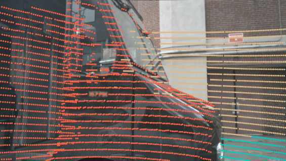
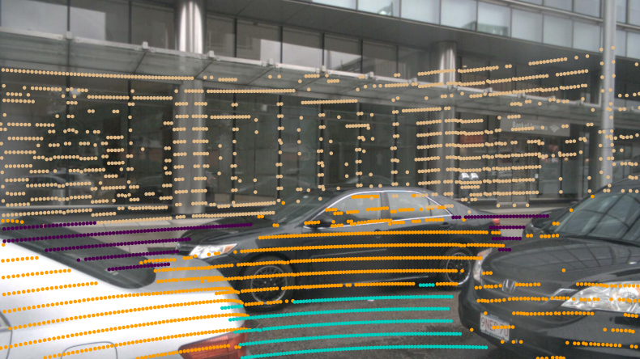

# Results

All results obtained by our work is shown below. To reproduce these results, follow the instructions in the ["Reproducing our results" section of the main README](README.md#reproducing-our-results). Further details and discussion can also be found in our paper (TODO LINK).

## nuScenes dataset analysis

### Points class distribution

<em>Distribution of foreground and background point proportions across semantic classes in the nuScenes dataset.</em>

### BG/FG proportion box plot

<em>Boxplots of background point proportions at frame and scene levels in the nuScenes dataset.</em>

### Outlier samples examples

<table>
<tr>
<td></td>
<td></td>
</tr>
<tr>
<td></td>
<td></td>
</tr>
</table>

<em>Examples of outlier samples with low background proportions. In the bottom right image, a crowded traffic scene results in a high density of foreground points. In the other images, a large nearby vehicle occupies a significant portion of the LiDAR field of view.</em>

## 3D object detection analysis

### Original models vs. GT filtered models

<table border="1" class="dataframe">
  <thead>
    <tr style="text-align: right;">
      <th>Model</th>
      <th>mAP ↑</th>
      <th>NDS ↑</th>
      <th>GFLOPS ↓</th>
      <th>Mem (GB) ↓</th>
      <th>FPS@1 ↑</th>
      <th>FPS@5 ↑</th>
      <th>CO2 (g) ↓</th>
    </tr>
  </thead>
  <tbody>
    <tr>
      <td>BEVFusion-L</td>
      <td>0.643</td>
      <td>0.691</td>
      <td>246.09</td>
      <td>2.81</td>
      <td>21.8</td>
      <td>38.6</td>
      <td>2.51</td>
    </tr>
    <tr>
      <td>BEVFusion-L*</td>
      <td><i>0.672 (+4.5%)</i></td>
      <td><i>0.704 (+1.9%)</i></td>
      <td>185.67 (-24.6%)</td>
      <td>2.79 (-0.7%)</td>
      <td>26.8 (+22.8%)</td>
      <td>61.0 (+57.9%)</td>
      <td>1.69 (-32.6%)</td>
    </tr>
    <tr>
      <td>BEVFusion-L 3Dh</td>
      <td>0.639</td>
      <td>0.691</td>
      <td>230.48</td>
      <td>2.8</td>
      <td>17.2</td>
      <td>32.9</td>
      <td>3.1</td>
    </tr>
    <tr>
      <td>BEVFusion-L 3Dh*</td>
      <td>0.666 (+4.3%)</td>
      <td>0.702 (+1.5%)</td>
      <td>113.65 (-50.7%)</td>
      <td>2.78 (-0.7%)</td>
      <td>22.1 (+28.1%)</td>
      <td>65.9 (+100.2%)</td>
      <td>1.58 (-49.0%)</td>
    </tr>
    <tr>
      <td>CenterPoint-Voxel</td>
      <td>0.557</td>
      <td>0.642</td>
      <td>163.53</td>
      <td>1.06</td>
      <td>14.5</td>
      <td>26.4</td>
      <td>3.27</td>
    </tr>
    <tr>
      <td>CenterPoint-Voxel*</td>
      <td>0.612 (+10.0%)</td>
      <td>0.669 (+4.2%)</td>
      <td>121.62 (-25.6%)</td>
      <td>0.45 (-57.4%)</td>
      <td>17.2 (+18.1%)</td>
      <td>39.0 (+47.6%)</td>
      <td>1.54 (-52.9%)</td>
    </tr>
    <tr>
      <td>Ada3D</td>
      <td>0.548 (-1.62%)</td>
      <td>0.636 (-1.20%)</td>
      <td><b>--- (-56.9%)</b></td>
      <td>--- (-61.7%)</td>
      <td>---</td>
      <td>---</td>
      <td>---</td>
    </tr>
    <tr>
      <td>CenterPoint-Voxel 3Dh</td>
      <td>0.568</td>
      <td>0.65</td>
      <td>167.3</td>
      <td>1.06</td>
      <td>11.5</td>
      <td>22.8</td>
      <td>3.29</td>
    </tr>
    <tr>
      <td>CenterPoint-Voxel 3Dh*</td>
      <td>0.605 (+6.6%)</td>
      <td>0.664 (+2.0%)</td>
      <td><i>86.26 (-48.4%)</i></td>
      <td><i>0.45 (-57.5%)</i></td>
      <td>12.1 (+4.9%)</td>
      <td>35.0 (+53.8%)</td>
      <td>1.9 (-42.3%)</td>
    </tr>
    <tr>
      <td>CenterPoint-Pillar</td>
      <td>0.482</td>
      <td>0.593</td>
      <td>127.86</td>
      <td>3.22</td>
      <td>22.0</td>
      <td>48.9</td>
      <td>2.59</td>
    </tr>
    <tr>
      <td>CenterPoint-Pillar*</td>
      <td>0.576 (+19.5%)</td>
      <td>0.645 (+8.8%)</td>
      <td>127.25 (-0.5%)</td>
      <td>0.82 (-74.4%)</td>
      <td><i>34.5 (+56.9%)</i></td>
      <td><i>71.1 (+45.2%)</i></td>
      <td><i>1.4 (-46.0%)</i></td>
    </tr>
    <tr>
      <td>SSN</td>
      <td>0.461</td>
      <td>0.579</td>
      <td>237.34</td>
      <td>4.1</td>
      <td>9.3</td>
      <td>19.3</td>
      <td>9.29</td>
    </tr>
    <tr>
      <td>SSN*</td>
      <td>0.558 (+21.1%)</td>
      <td>0.635 (+9.8%)</td>
      <td>231.96 (-2.3%)</td>
      <td>0.8 (-80.5%)</td>
      <td>20.9 (+124.4%)</td>
      <td>32.0 (+65.7%)</td>
      <td>2.01 (-78.4%)</td>
    </tr>
    <tr>
      <td>PointPillars</td>
      <td>0.391</td>
      <td>0.527</td>
      <td>130.15</td>
      <td>12.91</td>
      <td>11.4</td>
      <td>18.0</td>
      <td>9.96</td>
    </tr>
    <tr>
      <td>PointPillars*</td>
      <td><b>0.503 (+28.8%)</b></td>
      <td><b>0.586 (+11.2%)</b></td>
      <td>112.92 (-13.2%)</td>
      <td><b>1.27 (-90.2%)</b></td>
      <td><b>27.7 (+143.5%)</b></td>
      <td><b>37.8 (+109.8%)</b></td>
      <td><b>1.84 (-81.5%)</b></td>
    </tr>
  </tbody>
</table>

<em>Performance results of the models. ↑ indicates that higher values are better and ↓ that lower values are better. Values in parentheses indicate the percentage improvement over the unfiltered baseline. Models marked with * are trained and evaluated using filtered point clouds. Italic values denote the best overall result and bold the largest percentage improvement.</em>

### Mantained BG (%) vs. Voxel size

<em>Percentage of background points retained after voxel-based filtering as voxel size increases from 1x to 32x.</em>

### Model degradation by increasing levels of BG removal

<em>mAP degradation (ΔmAP) of detection models evaluated with different voxel size multipliers, which preserve increasing amounts of background information.</em>

## Mean AP by class

<table border="1" class="dataframe">
  <thead>
    <tr style="text-align: right;">
      <th>Model</th>
      <th>Car</th>
      <th>Ped.</th>
      <th>Mot.</th>
      <th>Bic.</th>
      <th>Truck</th>
      <th>Bus</th>
      <th>Trailer</th>
      <th>Const.</th>
      <th>Cone</th>
      <th>Barrier</th>
    </tr>
  </thead>
  <tbody>
    <tr>
      <td>BEVFusion-L</td>
      <td>0.229</td>
      <td>0.220</td>
      <td>0.183</td>
      <td>0.139</td>
      <td>0.177</td>
      <td>0.219</td>
      <td>0.164</td>
      <td>0.115</td>
      <td>0.193</td>
      <td>0.188</td>
    </tr>
    <tr>
      <td>BEVFusion-L*</td>
      <td>0.231 (+0.9%)</td>
      <td>0.231 (+4.9%)</td>
      <td>0.186 (+1.3%)</td>
      <td>0.153 (+10.4%)</td>
      <td>0.178 (+0.9%)</td>
      <td>0.219 (+0.1%)</td>
      <td>0.174 (+6.2%)</td>
      <td>0.136 (+18.6%)</td>
      <td>0.208 (+7.6%)</td>
      <td>0.199 (+5.9%)</td>
    </tr>
    <tr>
      <td>BEVFusion-L 3Dh</td>
      <td>0.227</td>
      <td>0.223</td>
      <td>0.188</td>
      <td>0.140</td>
      <td>0.179</td>
      <td>0.216</td>
      <td>0.145</td>
      <td>0.114</td>
      <td>0.200</td>
      <td>0.189</td>
    </tr>
    <tr>
      <td>BEVFusion-L 3Dh*</td>
      <td>0.229 (+0.9%)</td>
      <td>0.231 (+3.5%)</td>
      <td>0.185 (-1.8%)</td>
      <td>0.153 (+9.3%)</td>
      <td>0.182 (+1.6%)</td>
      <td>0.218 (+1.1%)</td>
      <td>0.156 (+7.7%)</td>
      <td>0.142 (+24.4%)</td>
      <td>0.208 (+4.5%)</td>
      <td>0.210 (+11.2%)</td>
    </tr>
    <tr>
      <td>CenterPoint-Voxel</td>
      <td>0.225</td>
      <td>0.213</td>
      <td>0.142</td>
      <td>0.091</td>
      <td>0.162</td>
      <td>0.202</td>
      <td>0.140</td>
      <td>0.075</td>
      <td>0.169</td>
      <td>0.176</td>
    </tr>
    <tr>
      <td>CenterPoint-Voxel*</td>
      <td>0.227 (+1.0%)</td>
      <td>0.225 (+6.0%)</td>
      <td>0.151 (+5.8%)</td>
      <td>0.134 (+46.4%)</td>
      <td>0.167 (+3.3%)</td>
      <td>0.200 (-1.3%)</td>
      <td>0.160 (+14.4%)</td>
      <td>0.097 (+29.2%)</td>
      <td>0.196 (+16.1%)</td>
      <td>0.192 (+9.0%)</td>
    </tr>
    <tr>
      <td>CenterPoint-Voxel 3Dh</td>
      <td>0.223</td>
      <td>0.216</td>
      <td>0.146</td>
      <td>0.101</td>
      <td>0.167</td>
      <td>0.197</td>
      <td>0.135</td>
      <td>0.075</td>
      <td>0.179</td>
      <td>0.180</td>
    </tr>
    <tr>
      <td>CenterPoint-Voxel 3Dh*</td>
      <td>0.226 (+1.1%)</td>
      <td>0.225 (+4.3%)</td>
      <td>0.151 (+3.6%)</td>
      <td>0.131 (+29.3%)</td>
      <td>0.166 (-0.5%)</td>
      <td>0.199 (+0.8%)</td>
      <td>0.149 (+10.9%)</td>
      <td>0.089 (+18.7%)</td>
      <td>0.197 (+9.9%)</td>
      <td>0.195 (+8.5%)</td>
    </tr>
    <tr>
      <td>CenterPoint-Pillar</td>
      <td>0.223</td>
      <td>0.198</td>
      <td>0.112</td>
      <td>0.040</td>
      <td>0.148</td>
      <td>0.189</td>
      <td>0.126</td>
      <td>0.051</td>
      <td>0.147</td>
      <td>0.169</td>
    </tr>
    <tr>
      <td>CenterPoint-Pillar*</td>
      <td>0.226 (+1.3%)</td>
      <td>0.220 (+11.3%)</td>
      <td>0.136 (+21.3%)</td>
      <td>0.107 (+166.0%)</td>
      <td>0.157 (+5.9%)</td>
      <td>0.197 (+4.2%)</td>
      <td>0.149 (+18.3%)</td>
      <td>0.099 (+93.2%)</td>
      <td>0.184 (+25.1%)</td>
      <td>0.184 (+8.9%)</td>
    </tr>
    <tr>
      <td>SSN</td>
      <td>0.222</td>
      <td>0.175</td>
      <td>0.127</td>
      <td>0.062</td>
      <td>0.160</td>
      <td>0.196</td>
      <td>0.135</td>
      <td>0.074</td>
      <td>0.086</td>
      <td>0.166</td>
    </tr>
    <tr>
      <td>SSN*</td>
      <td>0.226 (+2.0%)</td>
      <td>0.214 (+22.4%)</td>
      <td>0.147 (+16.0%)</td>
      <td>0.123 (+98.4%)</td>
      <td>0.166 (+4.0%)</td>
      <td>0.204 (+4.4%)</td>
      <td>0.154 (+14.5%)</td>
      <td>0.123 (+66.4%)</td>
      <td>0.132 (+54.6%)</td>
      <td>0.197 (+18.5%)</td>
    </tr>
    <tr>
      <td>PointPillars</td>
      <td>0.217</td>
      <td>0.178</td>
      <td>0.104</td>
      <td>0.029</td>
      <td>0.121</td>
      <td>0.153</td>
      <td>0.124</td>
      <td>0.029</td>
      <td>0.100</td>
      <td>0.160</td>
    </tr>
    <tr>
      <td>PointPillars*</td>
      <td>0.224 (+3.3%)</td>
      <td>0.219 (+23.4%)</td>
      <td>0.117 (+12.3%)</td>
      <td>0.083 (+181.3%)</td>
      <td>0.137 (+13.6%)</td>
      <td>0.162 (+6.1%)</td>
      <td>0.155 (+25.3%)</td>
      <td>0.084 (+192.8%)</td>
      <td>0.155 (+55.1%)</td>
      <td>0.198 (+23.6%)</td>
    </tr>
  </tbody>
</table>

<em>Mean Average Precision (AP) at thresholds 0.5, 1.0, 2.0 and 4.0m results for each class and model. Values in parentheses indicate the percentage improvement over the unfiltered baseline. Models marked with * are trained and evaluated using filtered point clouds.</em>

## AP at 0.5m threshold by class

<table border="1" class="dataframe">
  <thead>
    <tr style="text-align: right;">
      <th>Model</th>
      <th>Car</th>
      <th>Ped.</th>
      <th>Mot.</th>
      <th>Bic.</th>
      <th>Truck</th>
      <th>Bus</th>
      <th>Trailer</th>
      <th>Const.</th>
      <th>Cone</th>
      <th>Barrier</th>
    </tr>
  </thead>
  <tbody>
    <tr>
      <td>BEVFusion-L</td>
      <td>0.785</td>
      <td>0.846</td>
      <td>0.605</td>
      <td>0.523</td>
      <td>0.415</td>
      <td>0.464</td>
      <td>0.138</td>
      <td>0.037</td>
      <td>0.714</td>
      <td>0.600</td>
    </tr>
    <tr>
      <td>BEVFusion-L*</td>
      <td>0.775 (-1.3%)</td>
      <td>0.901 (+6.4%)</td>
      <td>0.602 (-0.6%)</td>
      <td>0.572 (+9.2%)</td>
      <td>0.386 (-7.1%)</td>
      <td>0.533 (+14.8%)</td>
      <td>0.136 (-1.4%)</td>
      <td>0.034 (-6.3%)</td>
      <td>0.784 (+9.8%)</td>
      <td>0.638 (+6.4%)</td>
    </tr>
    <tr>
      <td>BEVFusion-L 3Dh</td>
      <td>0.775</td>
      <td>0.859</td>
      <td>0.615</td>
      <td>0.533</td>
      <td>0.385</td>
      <td>0.436</td>
      <td>0.116</td>
      <td>0.027</td>
      <td>0.741</td>
      <td>0.615</td>
    </tr>
    <tr>
      <td>BEVFusion-L 3Dh*</td>
      <td>0.767 (-1.1%)</td>
      <td>0.901 (+5.0%)</td>
      <td>0.619 (+0.6%)</td>
      <td>0.572 (+7.3%)</td>
      <td>0.381 (-1.0%)</td>
      <td>0.379 (-13.1%)</td>
      <td>0.113 (-2.4%)</td>
      <td>0.039 (+42.5%)</td>
      <td>0.788 (+6.3%)</td>
      <td>0.664 (+8.1%)</td>
    </tr>
    <tr>
      <td>CenterPoint-Voxel</td>
      <td>0.742</td>
      <td>0.794</td>
      <td>0.471</td>
      <td>0.344</td>
      <td>0.360</td>
      <td>0.405</td>
      <td>0.104</td>
      <td>0.027</td>
      <td>0.596</td>
      <td>0.535</td>
    </tr>
    <tr>
      <td>CenterPoint-Voxel*</td>
      <td>0.743 (+0.1%)</td>
      <td>0.858 (+8.0%)</td>
      <td>0.497 (+5.6%)</td>
      <td>0.502 (+45.8%)</td>
      <td>0.371 (+2.9%)</td>
      <td>0.420 (+3.5%)</td>
      <td>0.110 (+5.0%)</td>
      <td>0.030 (+10.3%)</td>
      <td>0.717 (+20.2%)</td>
      <td>0.584 (+9.1%)</td>
    </tr>
    <tr>
      <td>CenterPoint-Voxel 3Dh</td>
      <td>0.735</td>
      <td>0.810</td>
      <td>0.499</td>
      <td>0.388</td>
      <td>0.357</td>
      <td>0.397</td>
      <td>0.093</td>
      <td>0.019</td>
      <td>0.639</td>
      <td>0.566</td>
    </tr>
    <tr>
      <td>CenterPoint-Voxel 3Dh*</td>
      <td>0.733 (-0.3%)</td>
      <td>0.861 (+6.4%)</td>
      <td>0.492 (-1.3%)</td>
      <td>0.495 (+27.4%)</td>
      <td>0.357 (+0.1%)</td>
      <td>0.404 (+1.8%)</td>
      <td>0.115 (+23.4%)</td>
      <td>0.025 (+30.3%)</td>
      <td>0.723 (+13.2%)</td>
      <td>0.593 (+4.7%)</td>
    </tr>
    <tr>
      <td>CenterPoint-Pillar</td>
      <td>0.728</td>
      <td>0.733</td>
      <td>0.352</td>
      <td>0.147</td>
      <td>0.305</td>
      <td>0.346</td>
      <td>0.088</td>
      <td>0.009</td>
      <td>0.495</td>
      <td>0.433</td>
    </tr>
    <tr>
      <td>CenterPoint-Pillar*</td>
      <td>0.738 (+1.3%)</td>
      <td>0.838 (+14.3%)</td>
      <td>0.432 (+22.6%)</td>
      <td>0.401 (+172.4%)</td>
      <td>0.321 (+5.3%)</td>
      <td>0.419 (+21.0%)</td>
      <td>0.123 (+40.2%)</td>
      <td>0.025 (+186.0%)</td>
      <td>0.666 (+34.5%)</td>
      <td>0.507 (+17.1%)</td>
    </tr>
    <tr>
      <td>SSN</td>
      <td>0.712</td>
      <td>0.646</td>
      <td>0.407</td>
      <td>0.188</td>
      <td>0.317</td>
      <td>0.320</td>
      <td>0.036</td>
      <td>0.001</td>
      <td>0.222</td>
      <td>0.313</td>
    </tr>
    <tr>
      <td>SSN*</td>
      <td>0.727 (+2.1%)</td>
      <td>0.824 (+27.5%)</td>
      <td>0.502 (+23.4%)</td>
      <td>0.435 (+131.1%)</td>
      <td>0.310 (-2.4%)</td>
      <td>0.313 (-2.2%)</td>
      <td>0.070 (+92.6%)</td>
      <td>0.005 (+261.5%)</td>
      <td>0.404 (+82.1%)</td>
      <td>0.380 (+21.2%)</td>
    </tr>
    <tr>
      <td>PointPillars</td>
      <td>0.665</td>
      <td>0.663</td>
      <td>0.318</td>
      <td>0.086</td>
      <td>0.152</td>
      <td>0.105</td>
      <td>0.008</td>
      <td>0.000</td>
      <td>0.290</td>
      <td>0.294</td>
    </tr>
    <tr>
      <td>PointPillars*</td>
      <td>0.699 (+5.1%)</td>
      <td>0.850 (+28.2%)</td>
      <td>0.396 (+24.7%)</td>
      <td>0.283 (+227.6%)</td>
      <td>0.208 (+36.5%)</td>
      <td>0.175 (+65.9%)</td>
      <td>0.060 (+628.0%)</td>
      <td>0.000 (0.0%)</td>
      <td>0.520 (+79.6%)</td>
      <td>0.405 (+37.9%)</td>
    </tr>
  </tbody>
</table>

<em>Average Precision (AP) at threshold 0.5m results for each class and model. Values in parentheses indicate the percentage improvement over the unfiltered baseline. Models marked with * are trained and evaluated using filtered point clouds.</em>

## AP at 1.0m threshold by class

<table border="1" class="dataframe">
  <thead>
    <tr style="text-align: right;">
      <th>Model</th>
      <th>Car</th>
      <th>Ped.</th>
      <th>Mot.</th>
      <th>Bic.</th>
      <th>Truck</th>
      <th>Bus</th>
      <th>Trailer</th>
      <th>Const.</th>
      <th>Cone</th>
      <th>Barrier</th>
    </tr>
  </thead>
  <tbody>
    <tr>
      <td>BEVFusion-L</td>
      <td>0.876</td>
      <td>0.858</td>
      <td>0.706</td>
      <td>0.548</td>
      <td>0.599</td>
      <td>0.728</td>
      <td>0.399</td>
      <td>0.179</td>
      <td>0.726</td>
      <td>0.699</td>
    </tr>
    <tr>
      <td>BEVFusion-L*</td>
      <td>0.875 (-0.1%)</td>
      <td>0.910 (+6.0%)</td>
      <td>0.717 (+1.6%)</td>
      <td>0.610 (+11.3%)</td>
      <td>0.583 (-2.6%)</td>
      <td>0.730 (+0.2%)</td>
      <td>0.375 (-6.1%)</td>
      <td>0.215 (+20.3%)</td>
      <td>0.793 (+9.3%)</td>
      <td>0.739 (+5.8%)</td>
    </tr>
    <tr>
      <td>BEVFusion-L 3Dh</td>
      <td>0.867</td>
      <td>0.871</td>
      <td>0.727</td>
      <td>0.555</td>
      <td>0.577</td>
      <td>0.693</td>
      <td>0.322</td>
      <td>0.141</td>
      <td>0.753</td>
      <td>0.706</td>
    </tr>
    <tr>
      <td>BEVFusion-L 3Dh*</td>
      <td>0.864 (-0.3%)</td>
      <td>0.910 (+4.5%)</td>
      <td>0.716 (-1.5%)</td>
      <td>0.607 (+9.3%)</td>
      <td>0.587 (+1.6%)</td>
      <td>0.688 (-0.6%)</td>
      <td>0.350 (+9.0%)</td>
      <td>0.188 (+33.7%)</td>
      <td>0.796 (+5.7%)</td>
      <td>0.778 (+10.2%)</td>
    </tr>
    <tr>
      <td>CenterPoint-Voxel</td>
      <td>0.852</td>
      <td>0.821</td>
      <td>0.554</td>
      <td>0.358</td>
      <td>0.524</td>
      <td>0.652</td>
      <td>0.329</td>
      <td>0.111</td>
      <td>0.618</td>
      <td>0.645</td>
    </tr>
    <tr>
      <td>CenterPoint-Voxel*</td>
      <td>0.851 (-0.1%)</td>
      <td>0.881 (+7.4%)</td>
      <td>0.586 (+5.9%)</td>
      <td>0.526 (+47.0%)</td>
      <td>0.546 (+4.2%)</td>
      <td>0.655 (+0.5%)</td>
      <td>0.359 (+9.3%)</td>
      <td>0.158 (+42.8%)</td>
      <td>0.737 (+19.2%)</td>
      <td>0.708 (+9.8%)</td>
    </tr>
    <tr>
      <td>CenterPoint-Voxel 3Dh</td>
      <td>0.841</td>
      <td>0.833</td>
      <td>0.568</td>
      <td>0.401</td>
      <td>0.537</td>
      <td>0.655</td>
      <td>0.309</td>
      <td>0.104</td>
      <td>0.667</td>
      <td>0.672</td>
    </tr>
    <tr>
      <td>CenterPoint-Voxel 3Dh*</td>
      <td>0.842 (+0.2%)</td>
      <td>0.881 (+5.7%)</td>
      <td>0.578 (+1.8%)</td>
      <td>0.519 (+29.2%)</td>
      <td>0.527 (-1.9%)</td>
      <td>0.642 (-1.9%)</td>
      <td>0.342 (+10.6%)</td>
      <td>0.140 (+34.0%)</td>
      <td>0.741 (+11.1%)</td>
      <td>0.723 (+7.6%)</td>
    </tr>
    <tr>
      <td>CenterPoint-Pillar</td>
      <td>0.844</td>
      <td>0.756</td>
      <td>0.429</td>
      <td>0.155</td>
      <td>0.477</td>
      <td>0.588</td>
      <td>0.275</td>
      <td>0.070</td>
      <td>0.517</td>
      <td>0.619</td>
    </tr>
    <tr>
      <td>CenterPoint-Pillar*</td>
      <td>0.846 (+0.2%)</td>
      <td>0.860 (+13.7%)</td>
      <td>0.523 (+22.1%)</td>
      <td>0.425 (+174.5%)</td>
      <td>0.501 (+5.1%)</td>
      <td>0.623 (+6.0%)</td>
      <td>0.337 (+22.3%)</td>
      <td>0.149 (+111.2%)</td>
      <td>0.679 (+31.3%)</td>
      <td>0.679 (+9.7%)</td>
    </tr>
    <tr>
      <td>SSN</td>
      <td>0.835</td>
      <td>0.661</td>
      <td>0.489</td>
      <td>0.218</td>
      <td>0.506</td>
      <td>0.596</td>
      <td>0.253</td>
      <td>0.095</td>
      <td>0.245</td>
      <td>0.535</td>
    </tr>
    <tr>
      <td>SSN*</td>
      <td>0.848 (+1.5%)</td>
      <td>0.839 (+26.8%)</td>
      <td>0.574 (+17.2%)</td>
      <td>0.481 (+120.8%)</td>
      <td>0.505 (-0.1%)</td>
      <td>0.635 (+6.6%)</td>
      <td>0.251 (-0.5%)</td>
      <td>0.135 (+42.8%)</td>
      <td>0.427 (+74.3%)</td>
      <td>0.658 (+22.9%)</td>
    </tr>
    <tr>
      <td>PointPillars</td>
      <td>0.806</td>
      <td>0.675</td>
      <td>0.395</td>
      <td>0.107</td>
      <td>0.344</td>
      <td>0.418</td>
      <td>0.154</td>
      <td>0.013</td>
      <td>0.310</td>
      <td>0.520</td>
    </tr>
    <tr>
      <td>PointPillars*</td>
      <td>0.830 (+3.0%)</td>
      <td>0.860 (+27.3%)</td>
      <td>0.454 (+15.0%)</td>
      <td>0.322 (+202.0%)</td>
      <td>0.387 (+12.5%)</td>
      <td>0.418 (-0.0%)</td>
      <td>0.229 (+48.2%)</td>
      <td>0.068 (+405.2%)</td>
      <td>0.543 (+75.0%)</td>
      <td>0.676 (+30.0%)</td>
    </tr>
  </tbody>
</table>

<em>Average Precision (AP) at threshold 1.0m results for each class and model. Values in parentheses indicate the percentage improvement over the unfiltered baseline. Models marked with * are trained and evaluated using filtered point clouds.</em>

## AP at 2.0m threshold by class

<table border="1" class="dataframe">
  <thead>
    <tr style="text-align: right;">
      <th>Model</th>
      <th>Car</th>
      <th>Ped.</th>
      <th>Mot.</th>
      <th>Bic.</th>
      <th>Truck</th>
      <th>Bus</th>
      <th>Trailer</th>
      <th>Const.</th>
      <th>Cone</th>
      <th>Barrier</th>
    </tr>
  </thead>
  <tbody>
    <tr>
      <td>BEVFusion-L</td>
      <td>0.905</td>
      <td>0.869</td>
      <td>0.722</td>
      <td>0.551</td>
      <td>0.672</td>
      <td>0.853</td>
      <td>0.575</td>
      <td>0.335</td>
      <td>0.742</td>
      <td>0.737</td>
    </tr>
    <tr>
      <td>BEVFusion-L*</td>
      <td>0.910 (+0.5%)</td>
      <td>0.916 (+5.4%)</td>
      <td>0.733 (+1.5%)</td>
      <td>0.612 (+11.0%)</td>
      <td>0.666 (-1.0%)</td>
      <td>0.851 (-0.3%)</td>
      <td>0.602 (+4.8%)</td>
      <td>0.421 (+25.8%)</td>
      <td>0.810 (+9.1%)</td>
      <td>0.784 (+6.4%)</td>
    </tr>
    <tr>
      <td>BEVFusion-L 3Dh</td>
      <td>0.897</td>
      <td>0.881</td>
      <td>0.740</td>
      <td>0.557</td>
      <td>0.683</td>
      <td>0.827</td>
      <td>0.508</td>
      <td>0.351</td>
      <td>0.769</td>
      <td>0.744</td>
    </tr>
    <tr>
      <td>BEVFusion-L 3Dh*</td>
      <td>0.903 (+0.6%)</td>
      <td>0.917 (+4.1%)</td>
      <td>0.732 (-1.1%)</td>
      <td>0.610 (+9.4%)</td>
      <td>0.685 (+0.2%)</td>
      <td>0.837 (+1.2%)</td>
      <td>0.528 (+4.0%)</td>
      <td>0.448 (+27.9%)</td>
      <td>0.810 (+5.2%)</td>
      <td>0.827 (+11.0%)</td>
    </tr>
    <tr>
      <td>CenterPoint-Voxel</td>
      <td>0.884</td>
      <td>0.837</td>
      <td>0.563</td>
      <td>0.360</td>
      <td>0.607</td>
      <td>0.779</td>
      <td>0.471</td>
      <td>0.210</td>
      <td>0.637</td>
      <td>0.689</td>
    </tr>
    <tr>
      <td>CenterPoint-Voxel*</td>
      <td>0.893 (+1.0%)</td>
      <td>0.892 (+6.5%)</td>
      <td>0.597 (+6.1%)</td>
      <td>0.531 (+47.4%)</td>
      <td>0.629 (+3.7%)</td>
      <td>0.769 (-1.3%)</td>
      <td>0.536 (+13.7%)</td>
      <td>0.288 (+36.9%)</td>
      <td>0.755 (+18.5%)</td>
      <td>0.754 (+9.5%)</td>
    </tr>
    <tr>
      <td>CenterPoint-Voxel 3Dh</td>
      <td>0.879</td>
      <td>0.849</td>
      <td>0.576</td>
      <td>0.403</td>
      <td>0.625</td>
      <td>0.763</td>
      <td>0.452</td>
      <td>0.207</td>
      <td>0.686</td>
      <td>0.707</td>
    </tr>
    <tr>
      <td>CenterPoint-Voxel 3Dh*</td>
      <td>0.887 (+0.9%)</td>
      <td>0.894 (+5.3%)</td>
      <td>0.595 (+3.4%)</td>
      <td>0.522 (+29.4%)</td>
      <td>0.607 (-2.8%)</td>
      <td>0.757 (-0.8%)</td>
      <td>0.497 (+10.0%)</td>
      <td>0.271 (+31.0%)</td>
      <td>0.758 (+10.5%)</td>
      <td>0.768 (+8.7%)</td>
    </tr>
    <tr>
      <td>CenterPoint-Pillar</td>
      <td>0.879</td>
      <td>0.773</td>
      <td>0.436</td>
      <td>0.156</td>
      <td>0.556</td>
      <td>0.723</td>
      <td>0.425</td>
      <td>0.146</td>
      <td>0.544</td>
      <td>0.659</td>
    </tr>
    <tr>
      <td>CenterPoint-Pillar*</td>
      <td>0.889 (+1.2%)</td>
      <td>0.870 (+12.5%)</td>
      <td>0.536 (+22.9%)</td>
      <td>0.427 (+173.3%)</td>
      <td>0.583 (+4.9%)</td>
      <td>0.760 (+5.1%)</td>
      <td>0.508 (+19.5%)</td>
      <td>0.323 (+120.7%)</td>
      <td>0.700 (+28.8%)</td>
      <td>0.722 (+9.4%)</td>
    </tr>
    <tr>
      <td>SSN</td>
      <td>0.874</td>
      <td>0.680</td>
      <td>0.500</td>
      <td>0.227</td>
      <td>0.606</td>
      <td>0.752</td>
      <td>0.436</td>
      <td>0.243</td>
      <td>0.280</td>
      <td>0.629</td>
    </tr>
    <tr>
      <td>SSN*</td>
      <td>0.892 (+2.0%)</td>
      <td>0.849 (+24.8%)</td>
      <td>0.584 (+16.6%)</td>
      <td>0.490 (+116.3%)</td>
      <td>0.621 (+2.5%)</td>
      <td>0.780 (+3.7%)</td>
      <td>0.461 (+5.5%)</td>
      <td>0.348 (+43.4%)</td>
      <td>0.465 (+65.8%)</td>
      <td>0.762 (+21.2%)</td>
    </tr>
    <tr>
      <td>PointPillars</td>
      <td>0.850</td>
      <td>0.690</td>
      <td>0.407</td>
      <td>0.111</td>
      <td>0.441</td>
      <td>0.573</td>
      <td>0.365</td>
      <td>0.072</td>
      <td>0.343</td>
      <td>0.607</td>
    </tr>
    <tr>
      <td>PointPillars*</td>
      <td>0.880 (+3.6%)</td>
      <td>0.870 (+26.0%)</td>
      <td>0.463 (+13.8%)</td>
      <td>0.329 (+197.0%)</td>
      <td>0.495 (+12.2%)</td>
      <td>0.603 (+5.4%)</td>
      <td>0.424 (+16.4%)</td>
      <td>0.217 (+202.1%)</td>
      <td>0.572 (+66.6%)</td>
      <td>0.767 (+26.4%)</td>
    </tr>
  </tbody>
</table>

<em>Average Precision (AP) at threshold 2.0m results for each class and model. Values in parentheses indicate the percentage improvement over the unfiltered baseline. Models marked with * are trained and evaluated using filtered point clouds.</em>

## AP at 4.0m threshold by class

<table border="1" class="dataframe">
  <thead>
    <tr style="text-align: right;">
      <th>Model</th>
      <th>Car</th>
      <th>Ped.</th>
      <th>Mot.</th>
      <th>Bic.</th>
      <th>Truck</th>
      <th>Bus</th>
      <th>Trailer</th>
      <th>Const.</th>
      <th>Cone</th>
      <th>Barrier</th>
    </tr>
  </thead>
  <tbody>
    <tr>
      <td>BEVFusion-L</td>
      <td>0.917</td>
      <td>0.881</td>
      <td>0.734</td>
      <td>0.556</td>
      <td>0.707</td>
      <td>0.877</td>
      <td>0.654</td>
      <td>0.460</td>
      <td>0.773</td>
      <td>0.750</td>
    </tr>
    <tr>
      <td>BEVFusion-L*</td>
      <td>0.925 (+0.9%)</td>
      <td>0.924 (+4.9%)</td>
      <td>0.744 (+1.3%)</td>
      <td>0.614 (+10.4%)</td>
      <td>0.713 (+0.9%)</td>
      <td>0.877 (+0.1%)</td>
      <td>0.695 (+6.2%)</td>
      <td>0.545 (+18.6%)</td>
      <td>0.832 (+7.6%)</td>
      <td>0.795 (+5.9%)</td>
    </tr>
    <tr>
      <td>BEVFusion-L 3Dh</td>
      <td>0.910</td>
      <td>0.892</td>
      <td>0.751</td>
      <td>0.560</td>
      <td>0.715</td>
      <td>0.862</td>
      <td>0.578</td>
      <td>0.456</td>
      <td>0.798</td>
      <td>0.755</td>
    </tr>
    <tr>
      <td>BEVFusion-L 3Dh*</td>
      <td>0.918 (+0.9%)</td>
      <td>0.923 (+3.5%)</td>
      <td>0.738 (-1.8%)</td>
      <td>0.613 (+9.3%)</td>
      <td>0.727 (+1.6%)</td>
      <td>0.872 (+1.1%)</td>
      <td>0.623 (+7.7%)</td>
      <td>0.568 (+24.4%)</td>
      <td>0.834 (+4.5%)</td>
      <td>0.840 (+11.2%)</td>
    </tr>
    <tr>
      <td>CenterPoint-Voxel</td>
      <td>0.898</td>
      <td>0.851</td>
      <td>0.570</td>
      <td>0.365</td>
      <td>0.647</td>
      <td>0.809</td>
      <td>0.561</td>
      <td>0.302</td>
      <td>0.677</td>
      <td>0.704</td>
    </tr>
    <tr>
      <td>CenterPoint-Voxel*</td>
      <td>0.907 (+1.0%)</td>
      <td>0.902 (+6.0%)</td>
      <td>0.603 (+5.8%)</td>
      <td>0.534 (+46.4%)</td>
      <td>0.668 (+3.3%)</td>
      <td>0.798 (-1.3%)</td>
      <td>0.641 (+14.4%)</td>
      <td>0.390 (+29.2%)</td>
      <td>0.786 (+16.1%)</td>
      <td>0.767 (+9.0%)</td>
    </tr>
    <tr>
      <td>CenterPoint-Voxel 3Dh</td>
      <td>0.893</td>
      <td>0.864</td>
      <td>0.583</td>
      <td>0.405</td>
      <td>0.669</td>
      <td>0.789</td>
      <td>0.539</td>
      <td>0.301</td>
      <td>0.717</td>
      <td>0.721</td>
    </tr>
    <tr>
      <td>CenterPoint-Voxel 3Dh*</td>
      <td>0.903 (+1.1%)</td>
      <td>0.900 (+4.3%)</td>
      <td>0.604 (+3.6%)</td>
      <td>0.524 (+29.3%)</td>
      <td>0.665 (-0.5%)</td>
      <td>0.796 (+0.8%)</td>
      <td>0.598 (+10.9%)</td>
      <td>0.358 (+18.7%)</td>
      <td>0.788 (+9.9%)</td>
      <td>0.782 (+8.5%)</td>
    </tr>
    <tr>
      <td>CenterPoint-Pillar</td>
      <td>0.892</td>
      <td>0.791</td>
      <td>0.447</td>
      <td>0.162</td>
      <td>0.593</td>
      <td>0.756</td>
      <td>0.504</td>
      <td>0.205</td>
      <td>0.587</td>
      <td>0.677</td>
    </tr>
    <tr>
      <td>CenterPoint-Pillar*</td>
      <td>0.904 (+1.3%)</td>
      <td>0.881 (+11.3%)</td>
      <td>0.542 (+21.3%)</td>
      <td>0.430 (+166.0%)</td>
      <td>0.627 (+5.9%)</td>
      <td>0.788 (+4.2%)</td>
      <td>0.597 (+18.3%)</td>
      <td>0.397 (+93.2%)</td>
      <td>0.735 (+25.1%)</td>
      <td>0.737 (+8.9%)</td>
    </tr>
    <tr>
      <td>SSN</td>
      <td>0.888</td>
      <td>0.701</td>
      <td>0.508</td>
      <td>0.248</td>
      <td>0.640</td>
      <td>0.783</td>
      <td>0.540</td>
      <td>0.295</td>
      <td>0.343</td>
      <td>0.664</td>
    </tr>
    <tr>
      <td>SSN*</td>
      <td>0.906 (+2.0%)</td>
      <td>0.858 (+22.4%)</td>
      <td>0.589 (+16.0%)</td>
      <td>0.492 (+98.4%)</td>
      <td>0.665 (+4.0%)</td>
      <td>0.818 (+4.4%)</td>
      <td>0.618 (+14.5%)</td>
      <td>0.491 (+66.4%)</td>
      <td>0.530 (+54.6%)</td>
      <td>0.787 (+18.5%)</td>
    </tr>
    <tr>
      <td>PointPillars</td>
      <td>0.867</td>
      <td>0.711</td>
      <td>0.416</td>
      <td>0.118</td>
      <td>0.484</td>
      <td>0.611</td>
      <td>0.496</td>
      <td>0.115</td>
      <td>0.399</td>
      <td>0.639</td>
    </tr>
    <tr>
      <td>PointPillars*</td>
      <td>0.896 (+3.3%)</td>
      <td>0.877 (+23.4%)</td>
      <td>0.467 (+12.3%)</td>
      <td>0.332 (+181.3%)</td>
      <td>0.550 (+13.6%)</td>
      <td>0.648 (+6.1%)</td>
      <td>0.621 (+25.3%)</td>
      <td>0.336 (+192.8%)</td>
      <td>0.619 (+55.1%)</td>
      <td>0.790 (+23.6%)</td>
    </tr>
  </tbody>
</table>

<em>Average Precision (AP) at threshold 4.0m results for each class and model. Values in parentheses indicate the percentage improvement over the unfiltered baseline. Models marked with * are trained and evaluated using filtered point clouds.</em>

## Model degradation by increasing levels of BG removal by class and AP threhold

<table>
  <tbody>
    <tr>
      <td>0.5m</td>
      <td><a href="/figs/ap_classes_plots/car_0.5.svg">Car</a></td>
      <td><a href="/figs/ap_classes_plots/pedestrian_0.5.svg">Ped.</a></td>
      <td><a href="/figs/ap_classes_plots/motorcycle_0.5.svg">Mot.</a></td>
      <td><a href="/figs/ap_classes_plots/bicycle_0.5.svg">Bic.</a></td>
      <td><a href="/figs/ap_classes_plots/truck_0.5.svg">Truck</a></td>
      <td><a href="/figs/ap_classes_plots/bus_0.5.svg">Bus</a></td>
      <td><a href="/figs/ap_classes_plots/trailer_0.5.svg">Trailer</a></td>
      <td><a href="/figs/ap_classes_plots/construction_vehicle_0.5.svg">Const.</a></td>
      <td><a href="/figs/ap_classes_plots/traffic_cone_0.5.svg">Cone</a></td>
      <td><a href="/figs/ap_classes_plots/barrier_0.5.svg">Barrier</a></td>
    </tr>
    <tr>
      <td>1.0m</td>
      <td><a href="/figs/ap_classes_plots/car_1.0.svg">Car</a></td>
      <td><a href="/figs/ap_classes_plots/pedestrian_1.0.svg">Ped.</a></td>
      <td><a href="/figs/ap_classes_plots/motorcycle_1.0.svg">Mot.</a></td>
      <td><a href="/figs/ap_classes_plots/bicycle_1.0.svg">Bic.</a></td>
      <td><a href="/figs/ap_classes_plots/truck_1.0.svg">Truck</a></td>
      <td><a href="/figs/ap_classes_plots/bus_1.0.svg">Bus</a></td>
      <td><a href="/figs/ap_classes_plots/trailer_1.0.svg">Trailer</a></td>
      <td><a href="/figs/ap_classes_plots/construction_vehicle_1.0.svg">Const.</a></td>
      <td><a href="/figs/ap_classes_plots/traffic_cone_1.0.svg">Cone</a></td>
      <td><a href="/figs/ap_classes_plots/barrier_1.0.svg">Barrier</a></td>
    </tr>
    <tr>
      <td>2.0m</td>
      <td><a href="/figs/ap_classes_plots/car_2.0.svg">Car</a></td>
      <td><a href="/figs/ap_classes_plots/pedestrian_2.0.svg">Ped.</a></td>
      <td><a href="/figs/ap_classes_plots/motorcycle_2.0.svg">Mot.</a></td>
      <td><a href="/figs/ap_classes_plots/bicycle_2.0.svg">Bic.</a></td>
      <td><a href="/figs/ap_classes_plots/truck_2.0.svg">Truck</a></td>
      <td><a href="/figs/ap_classes_plots/bus_2.0.svg">Bus</a></td>
      <td><a href="/figs/ap_classes_plots/trailer_2.0.svg">Trailer</a></td>
      <td><a href="/figs/ap_classes_plots/construction_vehicle_2.0.svg">Const.</a></td>
      <td><a href="/figs/ap_classes_plots/traffic_cone_2.0.svg">Cone</a></td>
      <td><a href="/figs/ap_classes_plots/barrier_2.0.svg">Barrier</a></td>
    </tr>
    <tr>
      <td>4.0m</td>
      <td><a href="/figs/ap_classes_plots/car_4.0.svg">Car</a></td>
      <td><a href="/figs/ap_classes_plots/pedestrian_4.0.svg">Ped.</a></td>
      <td><a href="/figs/ap_classes_plots/motorcycle_4.0.svg">Mot.</a></td>
      <td><a href="/figs/ap_classes_plots/bicycle_4.0.svg">Bic.</a></td>
      <td><a href="/figs/ap_classes_plots/truck_4.0.svg">Truck</a></td>
      <td><a href="/figs/ap_classes_plots/bus_4.0.svg">Bus</a></td>
      <td><a href="/figs/ap_classes_plots/trailer_4.0.svg">Trailer</a></td>
      <td><a href="/figs/ap_classes_plots/construction_vehicle_4.0.svg">Const.</a></td>
      <td><a href="/figs/ap_classes_plots/traffic_cone_4.0.svg">Cone</a></td>
      <td><a href="/figs/ap_classes_plots/barrier_4.0.svg">Barrier</a></td>
    </tr>
    <tr>
      <td>mean</td>
      <td><a href="/figs/ap_classes_plots/car_mean.svg">Car</a></td>
      <td><a href="/figs/ap_classes_plots/pedestrian_mean.svg">Ped.</a></td>
      <td><a href="/figs/ap_classes_plots/motorcycle_mean.svg">Mot.</a></td>
      <td><a href="/figs/ap_classes_plots/bicycle_mean.svg">Bic.</a></td>
      <td><a href="/figs/ap_classes_plots/truck_mean.svg">Truck</a></td>
      <td><a href="/figs/ap_classes_plots/bus_mean.svg">Bus</a></td>
      <td><a href="/figs/ap_classes_plots/trailer_mean.svg">Trailer</a></td>
      <td><a href="/figs/ap_classes_plots/construction_vehicle_mean.svg">Const.</a></td>
      <td><a href="/figs/ap_classes_plots/traffic_cone_mean.svg">Cone</a></td>
      <td><a href="/figs/ap_classes_plots/barrier_mean.svg">Barrier</a></td>
    </tr>
  </tbody>
</table>
